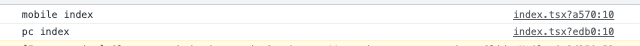
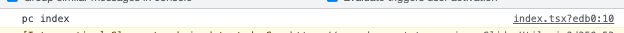

# 动态引入
[动态引入-官网](https://nextjs.org/docs/advanced-features/dynamic-import)
## 不使用动态引入
```js
// pages/index.tsx
import MobileIndex from '@/Mobile/Index';	// console.log('This is mobile index page.')
import PcIndex from '@/Pc/Index';	// console.log('This is pc index page.')
```
服务端：

客户端端：

可见，没有使用动态引入，则都被引入了。实际上只访问了pc或mobile的首页，不需要两个首页都引入。
## 使用动态引入
```js
// 改成下面写法
const MobileIndex = dynamic(() => import("@/Mobile/Index"));
const PcIndex = dynamic(() => import("@/Pc/Index"));
```
服务端：

客户端：

发现客户端确实是只引入了一个组件。
## 使用动态引入并且不在服务端运行

```js
// 改成下面写法
const MobileIndex = dynamic(() => import("@/Mobile/Index"), { ssr: false });
const PcIndex = dynamic(() => import("@/Pc/Index"), { ssr: false });
```
发现服务端无打印，客户端只引入了一个。