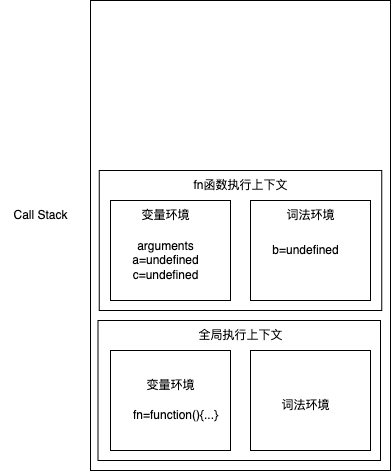
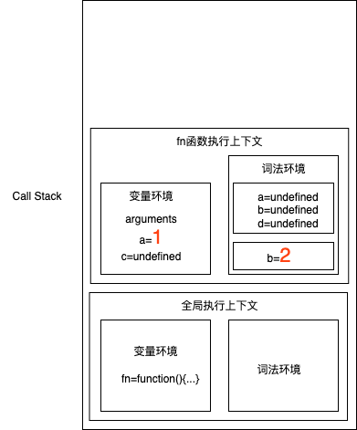
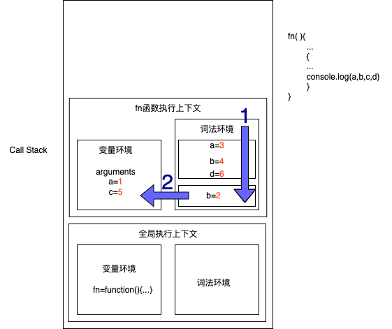

## 作用域
变量与函数的可访问范围。
### ES6前
- 全局作用域
- 函数作用域
### ES6
- 全局作用域
- 块级作用域
    被`{}`包裹
    - 函数
    - 判断语句
    - 循环语句
    - {}

## 通过`词法环境`支持块级作用域
```js
function fn() {
    var a = 1;
    let b = 2;
    {
        let a = 3;
        let b = 4;
        var c = 5;
        let d = 6;
        console.log(a, b, c, d) // 3,4,5,6
    }
    console.log(a, b, c) // 1,2,5
}
fn()
```
### 图示

- 编译并创建执行上下文阶段


- 执行代码
执行到fn内的作用域块时：


### 查找顺序


### 暂时性死区
在全局作用域或者某个块级作用域中，在显式的赋值之前访问一个let声明变量，会报错：
`Uncaught ReferenceError: Cannot access 'a' before initialization`