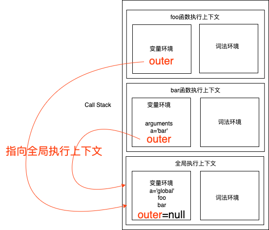
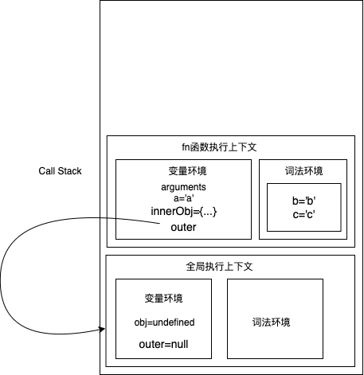
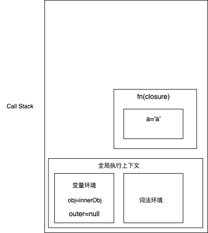
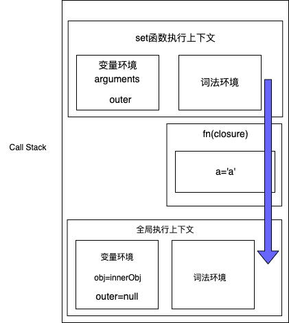

## 作用域链
```js
function foo(){
    console.log(a);
}
function bar(){
    var a = 'bar';
    foo();
}
var a = 'global';
bar()
```
### 图示
每个执行上下文的变量环境中，都包含了一个外部引用outer，用来指向外部的执行上下文。这条链条是查找变量的链条，称为作用域链。


**作用域链是由词法作用域决定的。**

## 词法作用域
指作用域由代码中函数声明的位置决定。词法作用域是静态作用域。

## 闭包
**A closure is the combination of a function bundled together (enclosed) with references to its surrounding state (the lexical environment).**
- 闭包=函数+词法环境，所以理论上，在js中所有的函数都是闭包！
- 实践层面上，同时满足下面条件的函数才是闭包：
    - 即使创建它的上下文已经销毁，它仍然存在（比如，内部函数从父函数中返回）
    - 在代码中引用了自由变量（指在函数中使用的，但既不是函数参数也不是函数的局部变量的变量。）
```js
function fn(){
    var a = 'a';
    let b = 'b';
    const c = 'c';
    var innerObj = {
        get:function(){
            return a;
        },
        set:function(v){
            a = v;
        }
    };
    return innerObj;
}
var obj = fn();
obj.set('A');
console.log(obj.get());
```

### 图示
- 执行到`return innerObj`


- 执行完`return innerObj`

根据词法作用域的规则，在`innerObj.get`和`innerObj.set`中可以访问到它所在函数`fn`中的变量。`fn`执行完，`fn`执行上下文从`Call Stack`中弹出，但是返回的`innerObj`中的方法使用到了`a`变量，所以`a`变量还会存在内存中。

- 执行到`obj.set('A')`
js引擎会沿着`set函数执行上下文`->`闭包fn`->`全局执行上下文`查找变量`a`


## 闭包的回收
如果引用闭包的函数是一个全局的变量，则闭包不会被回收，如果不再使用，则造成了内存的泄露。

## References
- [MDN-Closures](https://developer.mozilla.org/en-US/docs/Web/JavaScript/Closures)
- [Is the definition of JavaScript closures on MDN wrong?](https://stackoverflow.com/questions/50529400/is-the-definition-of-javascript-closures-on-mdn-wrong)
- [闭包](https://github.com/mqyqingfeng/Blog/issues/9)
- [什么是闭包](https://www.zhihu.com/question/34210214)
- [面试题](https://juejin.cn/post/6844903474212143117)