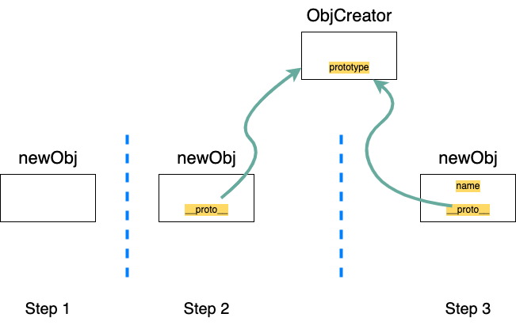

## 继承
- 基于类的设计
- 基于原型继承的设计

## 原型与原型链

- 对象的隐藏属性`__proto__`指向的就是该对象的原型，查找对象属性的路径就成为原型链
- 作用域链是沿着函数的作用域查找变量，原型链是沿着对象的原型查找属性。

## 构造函数创建对象
new加一个函数会创建一个对象。
- 创建一个空对象
- 将空对象的`__proto__`指向构造函数的`prototype`
- 调用构造函数，此时this指向新创建的对象，构造函数最后返回该对象。

## 关系
