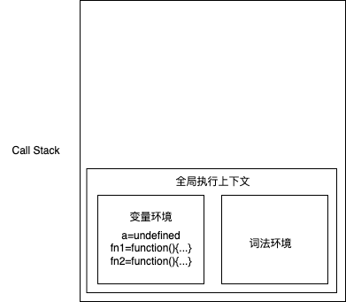
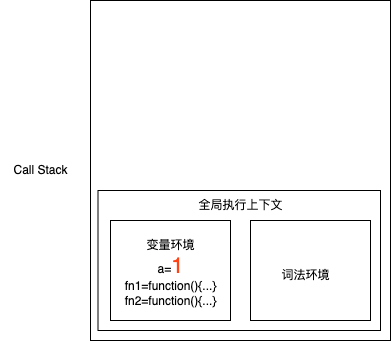
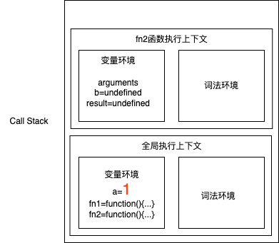
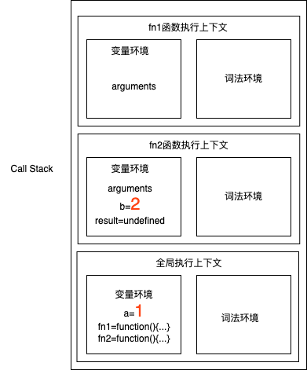
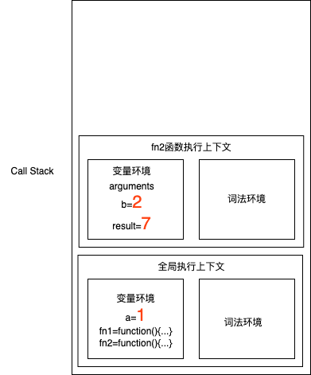

调用栈，也叫做执行上下文栈。

## 图示

```js
var a = 1;
function fn1(x, y){
    return x + y;
};
function fn2(){
    var b = 2;
    var result = fn1(3, 4)
    return a + b + result;
};
fn2();
```

- 创建全局上下文


- 执行代码
```js
a = 1
```


```js
fn2()
```


```js
fn1(3, 4)
```


fn1执行完后，返回结果给result


fn2执行完，只剩下全局执行上下文


## Related
- [尾调用优化](https://www.ruanyifeng.com/blog/2015/04/tail-call.html)
- [关于取消 ES6 函数尾递归的相关探究](https://juejin.cn/post/7081237136103440392)


