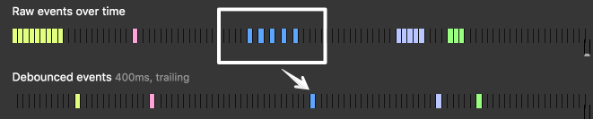

# Debounce and Throttle
`防抖`和`节流`是为了控制一个函数在时间段内执行的次数。
## Debounce
`防抖`将连续多次的调用变为一次调用。
*pics from css-tricks.com*

### Immediate
头调用。在`防抖`前执行一次。
## Throttle
`节流`允许函数在一段特定的时间内执行多次。与`防抖`不同的是，`节流`在一段特定的时间内，是不干扰函数的执行的。
## 自我理解
`防抖`就是他需要读满CD才能执行下一次，不能打断，如果再次触发则会打断，CD会重新读。函数可以是触发后立即执行，再进入读CD状态；也可以是触发后先读CD,CD过程中不被再次触发打断，在读完CD后执行。
`节流`则是降低攻速。单位时间内只执行一次，其余时间被等待时间填充，再此触发不会增长等待时间，可以是在等待时间前执行，也可以是等待时间后执行。
[理解参考](https://juejin.cn/post/6844903669389885453)
# Reference
[Debouncing and Throttling Explained Through Examples](https://css-tricks.com/debouncing-throttling-explained-examples/)