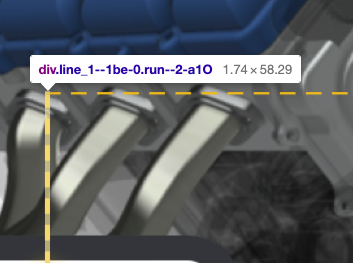

通过设置下边框实现蚂蚁线，样式如下，
```css
.auxiliary--2uG1L .breath_2_root--2uSid .line_2--3BI1- {
	position: absolute;
	top: 5px;
	left: -534px;
	width: 0;
	border-bottom: 2px dashed #f8b702;
}
```

通过设置左边框实现蚂蚁线，样式如下
```css
.auxiliary--2uG1L .breath_1_root--3wBBI .line_1--1be-0 {
	position: absolute;
	bottom: 10px;
	left: 5px;
	height: 0;
	border-left: 2px dashed #f8b702;
}
```
问题来了，为什么边框的宽度同样是1.74px，左边框能够完全渲染出来，而下边框则渲染为比1.74px小，猜测实际渲染出来为1px，Chrome浏览器渲染样式遇到数值时的规则是怎样的？还是只是对于边框宽度有特殊的规则？