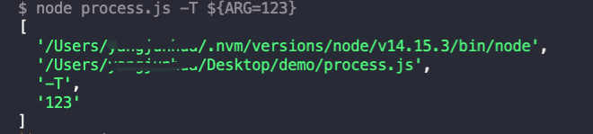

在看`Next`的examples/nextjs-docker的时候，发现有句`script`是这样写的：
```bash
"dev": "next dev -p ${PORT:=9100}"
```
执行了之后发现确实把9100传给了port，一直不理解这个写法。然后做实验，结果如下：
```js
// process.js
console.log(process.argv)
```

注意到`${}`里面，`ARG`其实被舍弃掉了，等号后面的值传给了`T`。至于为什么这样解析，我查看了`Node`的文档也没找到，但是至少知道这样的写法是有效的。