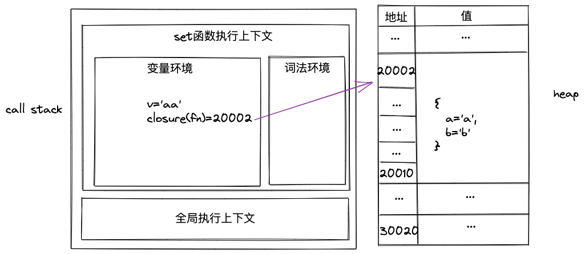

## 语言类型
动静态：是否在执行过程中确定数据类型。
强弱：数据类型是否可以被转换，包括隐式转换
故js是动态弱类型语言，c是静态弱类型语言。

## js数据类型
- 原始类型
- 引用类型

## js的内存机制

### js内存模型
- 代码空间
- 栈空间
- 堆空间

### 例子
```js
function fn(){
    var a = 'a'
    var b = a
    var c = {c:'c'}
    var d = c
}
fn()
```
执行到`fn()`时

原始类型的值存储在栈（执行栈）空间里，引用类型的值存储值堆空间中。这样做是为了便于切换执行上下文

### 闭包的内存模型
```js
function fn() {
    var a = 'a'
    let b = 'b'
    const c = 'c'
    var inner = {
        get() {
            console.log('get', b)
            return b
        },
        set(v) {
            console.log('set');
            a = v
        }
    }
    return inner
}
var o = fn()
o.set('aa')
o.get()
```
调用`set()`时

同理，调用`get()`时执行上下文也会包含`closure(fn)`这个对象。

