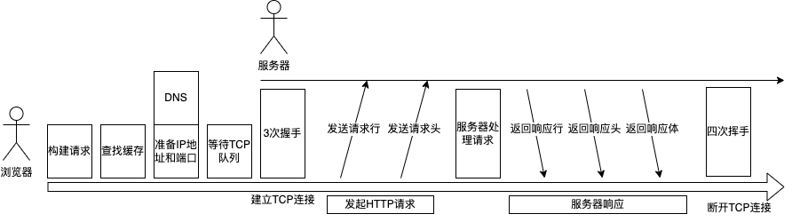

TCP/IP 作为传输层协议，HTTP 作为应用层协议。

## 浏览器发起HTTP流程
- 请求 DNS 返回域名对应 IP，也会走缓存获取解析过的域名
- 构建请求行信息
- 查找缓存
- 准备 IP 和端口供 TCP 建立连接，但可能需要等待，因为 Chrome 规定一个域名最多能建立6个 TCP 连接。
- 发送 HTTP 请求
    - 请求行
    - 请求头：包含浏览器的基础信息
    - 请求体

## 服务器处理HTTP流程
- 返回响应
    - 响应行：包含协议版本和状态码
    - 响应头：包含服务器的基础信息
    - 响应体
- 断开连接
    `Connection:Keep-Alive`：保持TCP连接
- 重定向

## 总结

