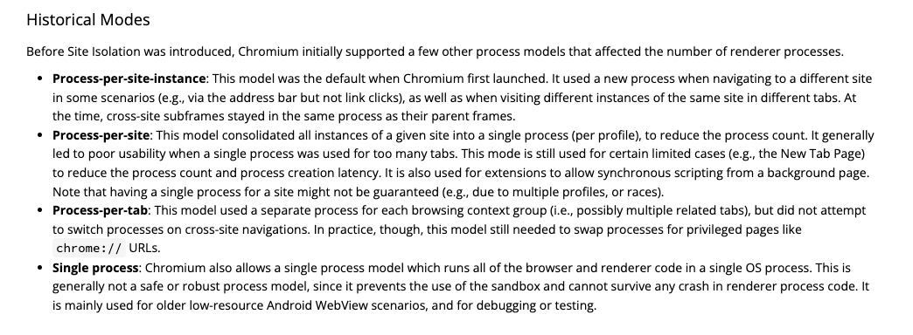

## 进程与线程
- 进程中的某一线程出错，整个进程崩溃
- 线程之间可以共享进程中的数据
- 进程关闭时会回收内存
- 进程之间相互隔离

## 浏览器架构历史

### 单进程
一个进程负责所有的功能，包括网络、插件、js runtime、渲染等。导致浏览器不稳定、不流畅、不安全。

### 多进程
- 早期：
    - 1个主进程：负责下载资源、管理IPC、显示渲染进程生成的网页图片。
    - 多个渲染进程：负责解析、渲染、js执行、合成网页图片。运行在沙箱里，无权访问操作系统或硬盘数据。
    - 多个插件进程
- 现代
    - 1个主进程：负责界面显示、用户交互、子进程管理、存储功能。
    - 1个GPU进程：负责3D CSS、网页、浏览器UI界面的绘制。
    - 1个网络进程：负责网络资源加载。
    - 多个渲染进程：排版引擎Blink和js引擎V8都运行在渲染进程，负责将HTML、CSS、JS转换为可以交互的网页。
    - 多个插件进程

## Reference
- [Process Model and Site Isolation](https://chromium.googlesource.com/chromium/src/+/main/docs/process_model_and_site_isolation.md)
- [Inside Broser](https://developer.chrome.com/blog/inside-browser-part1/)