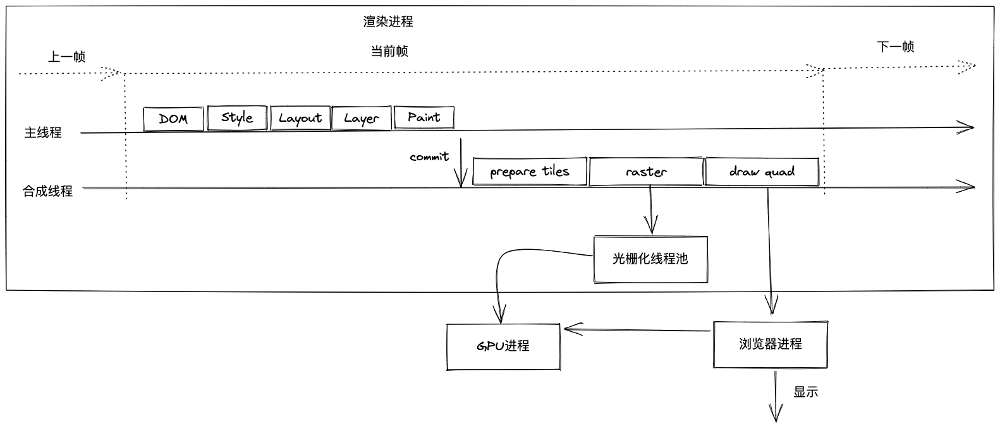

## 渲染流水线
- 构建 DOM 树
    将 HTML 转换为浏览器能够理解的结构——DOM 树。DOM 是保存在内存中的树结构，可以由js控制。
- 样式计算
    - 将样式表（内联、嵌入、外部）转换为浏览器能够理解的结构——CSSOM
    - 将CSSOM中的值标准化
    - 计算 DOM 树中每个节点的具体样式
        - 继承：每个 DOM 节点都包含有父节点的样式。UserAgent样式是浏览器提供的一组默认样式
        - 层叠：如何合并来自多个源的属性值的算法。
- 布局阶段
    计算出 DOM 树中可见元素的几何位置。
    - 创建布局树：只包含可见元素
    - 布局计算
- 分层
    为特定的节点生成专用的图层，并生成一棵对应的图层树。
    - 拥有层叠上下文属性的元素会被提升为单独的一层。（[层叠上下文](https://developer.mozilla.org/zh-CN/docs/Web/CSS/CSS_Positioning/Understanding_z_index/The_stacking_context)）
    - 需要剪裁（clip）的地方也会被创建为图层（文字多余父容器或者出现滚动条时，文字部分和滚动条部分会单独为一个图层）。
- 绘制
    将一个图层的绘制拆分成小的指令，这些指令按照顺序组成一个待绘制列表。
- 分块
    由于图层可以比视口大很多，必须要全部绘制，所以合成线程会将图层划分为图块（tile）。而图块是光栅化执行的最小单位
- 光栅化
    绘制操作由渲染引擎中的合成线程来完成。合成线程会按照视口附近的图块来优先生成位图，即光栅化。
- 合成
    光栅化完成，合成线程就会生成一个绘制图块的命令——“DrawQuad”，提交给浏览器进程。浏览器进程里面有一个叫 viz 的组件，用来接收合成线程发过来的“DrawQuad”命令，然后根据命令，将其页面内容绘制到内存中，最后再将内存显示在屏幕上。

## 重排
通过js或者css修改元素的几何位置和几何属性，触发重新布局。
## 重绘
通过js或者css修改元素的非几何属性，没有触发布局和分层，只需要重新绘制，
## 合成
使用transform实现动画，不会触发重排、重绘，只触发绘制后面的流程，即合成线程上的流程。